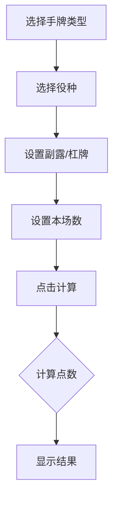

## 1. 产品概述
立直麻将算番算符工具是一款帮助麻将玩家快速计算胡牌点数的在线工具。用户输入手牌类型、役种、副露牌、杠牌等信息，系统自动计算番数、符数和应支付的点数。

## 2. 核心功能

### 2.1 用户角色
| 角色 | 注册方式 | 核心权限 |
|------|----------|----------|
| 普通用户 | 无需注册 | 使用算番算符功能 |

### 2.2 功能模块
1. **首页（算番工具）**：手牌输入、役种选择、副露设置、计算结果展示
2. **规则说明**：立直麻将规则、番种说明、符数计算规则

### 2.3 页面详情
| 页面名称 | 模块名称 | 功能描述 |
|----------|----------|----------|
| 首页 | 手牌输入区 | 选择手牌类型（门清/副露）、面子构成 |
| 首页 | 役种选择区 | 多选役种，自动计算总番数 |
| 首页 | 杠牌设置 | 设置明杠、暗杠数量及类型 |
| 首页 | 本场数设置 | 设置当前场数 |
| 首页 | 计算结果区 | 显示番数、符数、点数计算结果 |
| 规则说明 | 番种说明 | 列出所有役种及其番数 |
| 规则说明 | 符数规则 | 符数计算规则说明 |

## 3. 核心流程

## 4. 用户界面设计

### 4.1 设计风格
- **主色调**：绿色系（麻将桌风格），搭配金色作为强调色
- **按钮样式**：圆角矩形，悬停有阴影效果
- **字体**：思源黑体，清晰易读
- **布局**：卡片式布局，左右分栏

### 4.2 页面设计概述
| 页面名称 | 模块名称 | UI元素 |
|----------|----------|--------|
| 首页 | 手牌输入 | 下拉选择、按钮组 |
| 首页 | 役种选择 | 复选框列表，分组展示 |
| 首页 | 计算结果 | 大字号展示番数、符数、点数 |
| 规则说明 | 番种列表 | 表格展示，按番数分组 |

### 4.3 响应性
- 桌面优先设计，支持移动端自适应

## 5. 立直麻将规则要点

### 5.1 役种列表（部分）
- **役满**：大四喜、字一色、四暗刻、四杠子、绿一色、清老头、国士无双、九莲宝灯
- **双倍役满**：四暗刻单骑、国士无双十三面、纯正九莲宝灯
- **2番**：混一色、一气通贯、对对和、三色同顺、三暗刻、小三元、混老头
- **1番**：立直、一发、门前清自摸和、平和、断么九、役牌（场风、自风、三元牌）、一杯口、混全带幺九、三色同刻、三杠子、对对和（二翻）、三连刻

### 5.2 符数计算
- 基础符：20符（门清自摸）/ 30符（副露或吃胡）
- 加符项：
  - 门清：+10符
  - 单骑听牌：+2符
  - 字牌将：+2符
  - 役牌刻子：+2符（每暗刻+4符）
  - 三元牌刻子：+2符（每暗刻+4符）
  - 场风/自风刻子：+2符（每暗刻+4符）
  - 明杠：+2符
  - 暗杠：+4符
  - 平和：0符（不计符）

### 5.3 点数计算
- 基本点数 = 符数 × 2^(番数+2)
- 四舍五入到百位
- 本场数加成：每本场+100点
- 自摸时三家支付，吃胡时放铳者单独支付