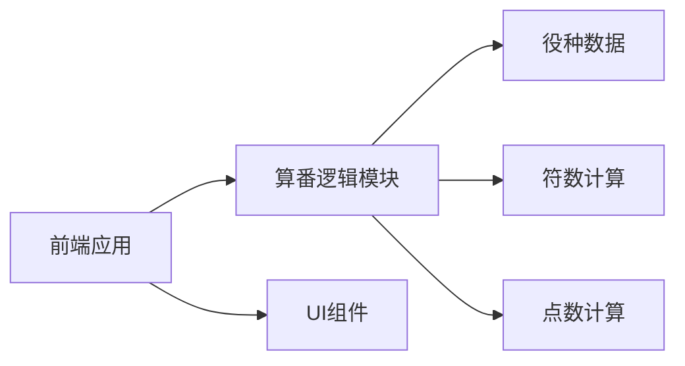

## 1. 架构设计


## 2. 技术描述
- Frontend: React@18 + TypeScript + TailwindCSS@3 + Vite
- 状态管理: Zustand
- 图标: Lucide React

## 3. 路由定义
| 路由 | 用途 |
|------|------|
| / | 首页（算番工具主页面） |
| /rules | 规则说明页面 |

## 4. 项目结构
```
src/
├── components/
│   ├── HandInput.tsx      # 手牌输入组件
│   ├── YakuSelector.tsx   # 役种选择组件
│   ├── KakanSettings.tsx  # 杠牌设置组件
│   ├── RoundSettings.tsx  # 本场数设置组件
│   └── ResultDisplay.tsx  # 结果展示组件
├── utils/
│   ├── yakuData.ts        # 役种数据定义
│   ├── fuCalculator.ts    # 符数计算逻辑
│   └── pointCalculator.ts # 点数计算逻辑
├── stores/
│   └── gameStore.ts       # 游戏状态管理
├── pages/
│   ├── Home.tsx           # 首页
│   └── Rules.tsx          # 规则说明页
├── App.tsx
├── main.tsx
└── index.css
```

## 5. 数据模型

### 5.1 役种数据结构
```typescript
interface Yaku {
  id: string;
  name: string;
  han: number;        // 番数，役满用特殊标记
  isYakuman: boolean; // 是否役满
  description: string;
  requiresMenzen: boolean; // 是否需要门清
}
```

### 5.2 游戏状态结构
```typescript
interface GameState {
  handType: 'menzen' | 'furo';           // 手牌类型
  selectedYaku: string[];                 // 选中的役种ID
  isTsumo: boolean;                       // 是否自摸
  isRon: boolean;                         // 是否吃胡
  openKanCount: number;                   // 明杠数量
  closedKanCount: number;                 // 暗杠数量
  roundCount: number;                     // 本场数
  hasTanyao: boolean;                     // 是否断么九
  hasPinfu: boolean;                      // 是否平和
  hasIipeikou: boolean;                   // 是否一杯口
  hasYakuhai: boolean;                    // 是否役牌
  yakuhaiCount: number;                   // 役牌刻子数量
}
```

### 5.3 计算结果结构
```typescript
interface CalculationResult {
  totalHan: number;           // 总番数
  totalFu: number;            // 总符数
  basePoints: number;         // 基础点数
  roundBonus: number;         // 本场加成
  tsumoPoints: {              // 自摸时各玩家支付
    dealer: number;           // 庄家支付
    nonDealer: number;        // 闲家支付
  };
  ronPoints: number;          // 吃胡时放铳者支付
}
```

## 6. 核心算法

### 6.1 符数计算
1. 基础符：门清自摸20符，副露或吃胡30符
2. 加符项：明杠+2符，暗杠+4符，役牌刻子+2符（暗刻+4符）
3. 特殊情况：平和牌型不计符

### 6.2 点数计算
1. 基本点数 = 符数 × 2^(番数+2)
2. 四舍五入到百位
3. 本场加成：每本场+100点
4. 自摸时：庄家支付=基本点数×1.5，闲家支付=基本点数
5. 吃胡时：放铳者支付=基本点数×4（庄家放铳）或×6（闲家放铳）